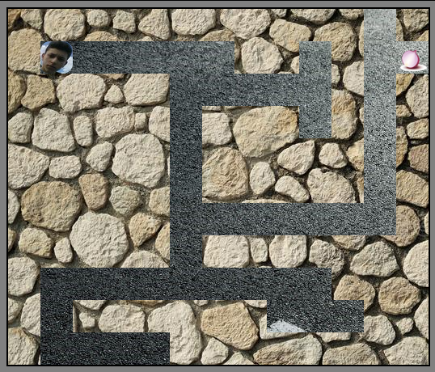

# Labyrinthe

* Projet fait par : Jniouen Wassim

* Dans le but d'un exercice pour ma formation   Web "Becode"

---------------------------------------------

## Date du projet 

* Projet commencé le Lundi 23 novembre 2020 et terminer le Mercredi 25 novembre 2020

---------------------------------------------

## Les consignes

[ => lien des consignes](https://github.com/becodeorg/bxl-hopper-1-25/tree/master/The%20Hill/projects/2.amazeing)

---------------------------------------------

## Languages utilisés + objectif

* Js

* HTML5

* CSS3

### Apprendre à mélanger le HTML du CSS et Js pour faire un Labyrinthe

---------------------------------------------

## Mon projet

[ => lien de mon projet ](https://jniouen-wassim.github.io/Labyrinthe/)

---------------------------------------------

## Screenshots de mon projets :

### License
© Jniouen Wassim
